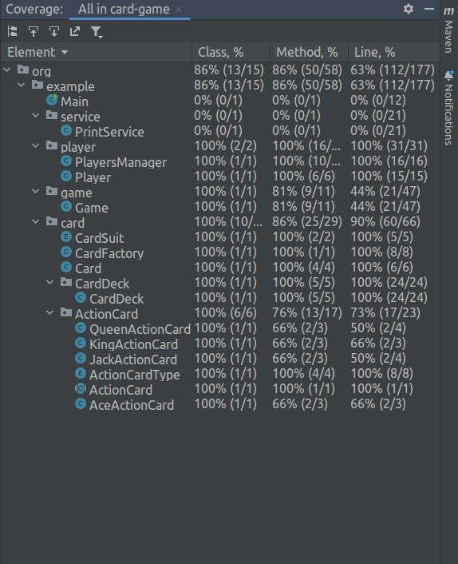

# Card-Game Challenge

To run the project, first clone the project. Then install Maven and Java(Version 19).

Then go to project root and run the following commands to run all the unit tests, package the code into a jar, and to execute that jar file:
```
mvn package
java -jar target/card-game-1.0-SNAPSHOT.jar
```

Here is the test coverage report:



To run the coverage yourself, open the project in IntelliJ IDEA, select "Projects" view, right click on `src -> test -> java` and select "Run with coverage"
